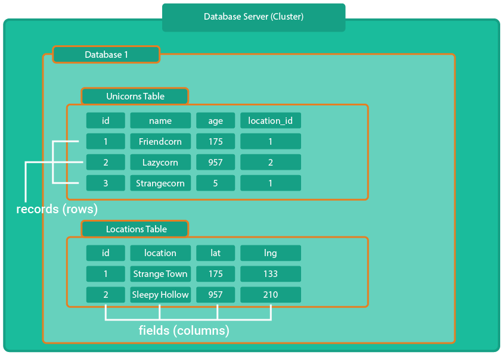
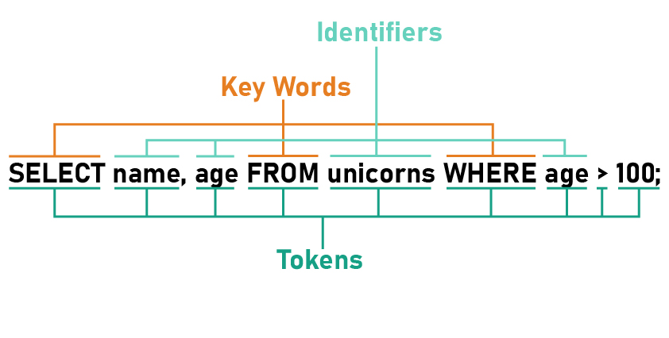

# SQL

- [What is RDBMS](#what-is-rdbms)
- [What is SQL](#what-is-sql)
- [Data Definition](#data-definition)
- [Data Types](#data-types)
- [Insert Data](#insert-data)
- [Querying Data](#querying-data)
- [Updating Data](#updating-data)
---

## What is RDBMS
RDBMS stands for **Relational Database Management System**.  In this, data can be stored in a tabular structure. The best-known RDBMS are, for example, **MySQL** or **PostgreSQL**.

An RDBMS can contain not only one, but several databases. These can be created, deleted or edited via the data management system.

A single database can contain many different tables. For example, one table for unicorns and another for locations.

### **Unicorns:**

| id  | name        | age | location_id |
| --- | ----------- | --- | ----------: |
| 1   | Friendcorn  | 175 |           1 |
| 2   | Lazycorn    | 957 |           2 |
| 3   | Strangecorn | 5   |           1 |

### **Locations:**

| id  | location          | lat | lng |
| --- | ------------- | --- | --: |
| 1   | Strange Town  | 175 |  33 |
| 2   | Sleepy Hollow | 55  | 199 |

It is possible to link the different tables together. Like **Unicorns** and **Locations** in the example above.

A table is divided into **fields (columns)** and **records (rows)**. It is important that a record must be assigned a unique id. This is important to be able to identify it later.



---

## What is SQL
SQL is the language that is required to communicate with a relational database.
In the core syntax, a distinction is made between **Key Words** and **Identifiers**. The **Key Words** are specified by the language itself. The **Identifiers** result from the various fields in a table. 



Syntax Regeln:
Syntax rules:
1. SQL statements must end with a semicolon (if multiple statements are included in the same command).
2. SQL statements are case-insensitive. This means that FROM is the same as from (for better identification of keywords, they should still be capitalized).
3. identifiers can be surrounded with double quotes to avoid conflicts with built-in keywords.
---
## Data Definition

When working with databases and tables, the following keywords are important.

- **CREATE** is needed to create a database or table.
- **ALTER** is needed to update an existing database or table.
- **DROP** is needed to delete an existing database or table

```SQL
CREATE DATABASE cornify;
```
___

## Data Types
Data types are needed to specify which value may be entered into the field of a table.

> Data types can differ depending on the RDBMS. In this chapter, the most common data types are discussed. Special data types for PostgreSQL can be looked up [here](https://www.postgresql.org/docs/current/datatype.html), for example.

**The most common data types are:**
- Character
- Numeric
- Date

---
## Character Types

The character types can be chosen between **CHAR(X)**, **VARCHAR(X)** and **TEXT** (The X indicates how many characters can be stored).

**CHAR(X)** and **VARCHAR(X)** are almost identical. The big difference is that the missing characters in **CHAR(X)** are filled with spaces.

**TEXT** can be used when a larger amount of text is to be stored. Like a blog post for example. The character type text stores a maximum size of 1GB (PostgreSQL).

Another special character type is the **ENUM**.
In an ENUM you can specify which concrete text values are allowed. For example: Mr | Mrs | Mx 
___

## Numeric Types
All Numeric Types for PostgreSQL can be read [here](https://www.postgresql.org/docs/current/datatype-numeric.html). However, the most important ones are **SMALLINT** and **INTEGER**. As well as **DECIMAL** and **NUMERIC**.

**SMALLINT** and **INTEGER** are numbers without decimal places.

**DECIMAL** and **NUMERIC** are used to store numbers with decimal places.

**REAL** and **DOUBLE** are the same then DECIMAL or NUMERIC. The difference is, that **REAL** and **DOUBLE** have variable-precision that means they are inexact. But therefore much faster performance.
___

## Date Types
All Date Types for PostgreSQL can be read [here](https://www.postgresql.org/docs/current/datatype-datetime.html).
The most important date types are **DATE** and **TIMESTAMP**.

**DATE** contains the current date without taking hours or minutes into account. 

**TIMESTAMP** is needed to store hours and minutes with consideration of the time zone.

With the help of the **DEFAULT** keyword, default values can be stored for the respective field. For a date type this can be helpful in combination with the **CURRENT_TIMESTAMP** keyword.

```SQL
CREATE TABLE conversations (
    id serial PRIMARY KEY,
    unicorn_name VARCHAR(200),
    clan_name VARCHAR(200), 
    message TEXT,
    timestamp TIMESTAMP DEFAULT CURRENT_TIMESTAMP 
)
```
___

## Other Types
Other data types that are often used are **BOOLEAN** (true or false), **JSON** or **XML**.

## What about files?
Databases are used to store primitive values. That means the path to a certain file can be stored in a database, not the file itself.
___

## Insert Data

With the keyword **INSERT** data can be stored in a database. The keyword **INTO** specifies in which table the data is stored.

The keyword **VALUES** can be used to specify which values are stored in the respective fields.

```SQL
INSERT INTO unicorns (unicorn_name, salary, unicorn_type) 
VALUES ('Lazyhorn', 8000, 'magical_one');
```

> **important** The column names in the round brackets before VALUES indicate the order in which the values must be entered.

---

## Querying Data
To query data you can use the **SELECT** keyword.
Followed by a * as wildcard you will get all fields.

If you want to query specific fields you can do that by field name.
With the **From** keyword you can specify the table you want to get out the data.

```SQL
SELECT (unicorn_name, id) FROM unicorns;
```
____

## Time to Practice:
An example for creating a table can be taken from [this](./sql/02-unicorns-table.sql). file.
How to create a record can be seen in the example above.

> It is important to ensure that the values take into account the correct data type of the respective field. A string as value should always be written in single quotes.

___

## Updating Data
The keyword **ALTER** is needed to update a table or a field.
All possibilities to update a field or table can be looked up [here](https://www.postgresql.org/docs/current/sql-altertable.html).

In the example below, the data type for yearly_salary has been changed to **REAL** in the clans table. 
Likewise, the field yearly_salary has been renamed to yearly_revenue.

```SQL
ALTER TABLE clans 
ALTER yearly_salary SET DATA TYPE REAL;

ALTER TABLE clans RENAME COLUMN yearly_salary TO yearly_revenue;
```

> **ALTER TABLE** allows you to run multiple updating operations together. You can, for example update two fields in one ALTER TABLE statement.
---


